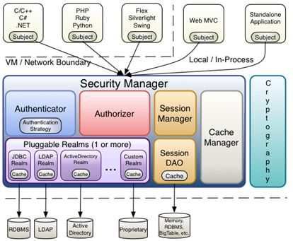
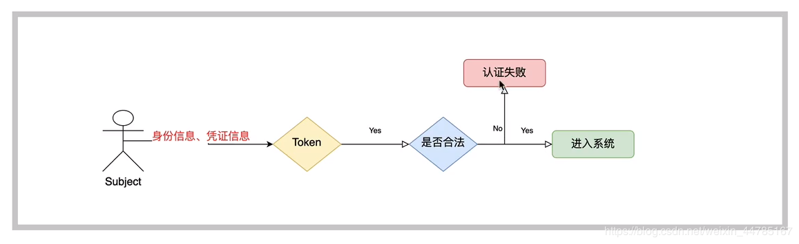

## 1.权限的管理

### 1.1什么是权限管理

基本上涉及到用户参与的系统都要进行权限管理，权限管理属于系统安全的范畴,权限管理实现对用户访问系统的控制，按照安全规则或者安全策略控制用户可以访问而且只能访问自己被授权的资源。
权限管理包括用户身份认证和授权两部分，简称认证授权。对于需要访问控制的资源用户首先经过身份认证，认证通过后用户具有该资源的访问权限方可访问。

### 1.2什么是身份认证

身份认证，就是判断一个用户是否为合法用户的处理过程。最常用的简单身份认证方式是系统通过核对用户输入的用户名和口令，看其是否与系统中存储的该用户的用户名和口令一致，来判断用户身份是否正确。对于采用指纹等系统，则出示指纹;对于硬件Key等刷卡系统，则需要刷卡

### 1.3什么是授权

授权，即访问控制，控制谁能访问哪些资源。主体进行身份认证后需要分配权限方可访问系统的资源，对于某些资源没有权限是无法访问的

## 2.什么是shiro

Shiro是apache旗下一一个开源框架，它将软件系统的安全认证相关的功能抽取出来，实现用户身份认证，权限授权、加密、会话管理等功能，组成了一 个通用的安全认证框架。




## 3. shiro的核心架构

### 3.1 Subject

​	**Subject 即主体**, 外部应用与subject进行交互, subject记录了当前操作用户,将用户的概念理解为当前操作的主体.Subject 在shiro 中是一个接口, 接口中定义了很多认证授权相关的方法, 外部程序通过subject 进行认证授权, 而subject 是通过 SecurityManager 安全管理器进行认证授权.

### 3.2 SecurityManager

​	**SecurityManager 即安全管理器**,对全部的subject 进行安全管理, 他是shiro 的核心, 负责对所有的subject进行安全管理. 通过SecurityManager 可以完成subject 的认证, 授权等. 实质上SecurityManager 是通过Authenticator 进行认证, 通过Authorizer进行授权, 通过SessionManager 进行会话管理.

### 3.3 Authenticator

​	**Authenticator 即认证器**, 对用户身份进行认证, Authenticator 是一个接口, shiro提供 ModularRealmAuthenticator 类, 通过ModularRealmAuthenticator 基本可以满足大多数需求, 也可以自定义 认证器.

### 3.4 Authorizer

​	**Authorizer 即授权器**, 用户通过认证器认证通过, 在访问功能时需要通过授权器判断用户是否有此功能的操作权限.

### 3.5 Realm

​	**Realm 即领域**, 相当于datasource 数据源, SecurityManager 进行安全认证需要通过Realm 获取用户权限数据, 比如: 如果用户身份在数据库 那么realm就需要从数据库获取用户信息.

> 注意: 不要把realm理解成只是从数据源取数据, 在realm中还有认证授权校验的相关代码.

### 3.6 SessionManager

​	**SessionManager 即会话管理**, shiro框架定义了一套会话管理, 他不依赖web容器的session, 所以shiro可以使用在非web应用上, 也可以将分布式应用的会话集中在一点管理, 此特性可使他实现单点登录.

### 3.7 SessionDao

​	**SessionDao 即会话Dao**, 是对session会话操作的一套接口, 比如要将session存储到数据库, 可以通过jdbc 将会话存储到数据库.

### 3.8 CacheManager

​	**CacheManager 即缓存管理**, 将用户权限数据存储在缓存, 这样可以提高性能.

### 3.9 CryptoGraphy

​	**CryptoGraphy 即密码管理**, shiro提供了一套加密/解密的组件, 方便开发. 比如提供常用的散列, 加解密等功能.


## 4.shiro中的认证

### 4.1认证：

​	**身份认证**,就是判断一个用户是否为合法用户的处理过程。最常用的简单身份认证方式是系统通过核对用户输入的用户名和口令，看其是否与系统中存储的该用户的用户名和口令一致，来判断用户身份是否正确。

### 4.2 shiro中认证的关键对象

+ **Subject: 主体**
  访问系统的用户，主体可以是用户、程序等，进行认证的都称为主体;
+ **Principal: 身份信息**
  是主体(subject) 进行身份认证的标识，标识必须具有唯一性， 如用户名、手机号、邮箱地址等，一个主体可以有多个身份，但是必须有-个主身份(Primary Principal)。
+ **credential:凭证信息**
  是只有主体自己知道的安全信息，如密码、证书等。

### 4.3认证流程图



1. 最终执行用户名比较 SimpleAccountRealm

   doGetAuthenticationInfo 在这个方法中完成用户名校验

2. 最终密码校验是在AuthenticatingRealm

   assertCredentialsMatch


总结

+ AuthenticatingRealm **认证** realm  doGetAuthenticationInfo
+ AuthorizingRealm **授权** realm doGetAuthorizationInfo


### 4.4 自定义realm

```java
// 自定义realm
public class CustomerRealm extends AuthorizingRealm {

    // 授权
    protected AuthorizationInfo doGetAuthorizationInfo(PrincipalCollection principals) {
        return null;
    }


    // 认证
    protected AuthenticationInfo doGetAuthenticationInfo(AuthenticationToken token) throws AuthenticationException {
        // 在token中获取用户名
        System.out.println(token.getPrincipal());

        // 根据身份信息使用jdbc 查询数据库
        if ("xiaoer".equals(token.getPrincipal())){
            return new SimpleAuthenticationInfo(token.getPrincipal(), "123", this.getName());
        }
        return null;
    }
}

// 使用
public static void testRealm(){
	// 1. 创建安全管理器
  DefaultSecurityManager securityManager = new DefaultSecurityManager();

  // 2. 给安全管理器设置 realm
  securityManager.setRealm(new CustomerRealm());

  // 3. SecurityUtils 全局安全工具类 设置安全管理器
  SecurityUtils.setSecurityManager(securityManager);

  // 4. 关键对象 subject 主体
  Subject subject = SecurityUtils.getSubject();

  // 5. 创建令牌
  UsernamePasswordToken token = new UsernamePasswordToken("hucong", "1233");

  // 用户认证
  try {
    subject.login(token);
    System.out.println("认证状态 : " + subject.isAuthenticated());
  } catch (Exception e) {
    e.printStackTrace();
  }
}
```


## 5. 第一个shiro项目

### 5.1 pom.xml

```xml
<dependencies>
  <dependency>
    <groupId>org.apache.shiro</groupId>
    <artifactId>shiro-core</artifactId>
    <version>1.5.3</version>
  </dependency>
  <dependency>
    <groupId>commons-logging</groupId>
    <artifactId>commons-logging</artifactId>
    <version>1.2</version>
  </dependency>
</dependencies>
```

### 5.2 shiro.ini 模拟从数据库拿信息

```ini
[users]
hucong=123
zs=123456
ls=666
```

### 5.3 测试demo

```java
public class shiroTest {
    public static void main(String[] args) {
        // 1. 创建安全管理器
        DefaultSecurityManager securityManager = new DefaultSecurityManager();

        // 2. 给安全管理器设置 realm
        securityManager.setRealm(new IniRealm("classpath:shiro.ini"));

        // 3. SecurityUtils 全局安全工具类 设置安全管理器
        SecurityUtils.setSecurityManager(securityManager);

        // 4. 关键对象 subject 主体
        Subject subject = SecurityUtils.getSubject();

        // 5. 创建令牌
        UsernamePasswordToken token = new UsernamePasswordToken("hucong", "1233");

        // 用户认证
        try {
            subject.login(token);
            System.out.println("认证状态 : " + subject.isAuthenticated());
        } catch (UnknownAccountException e) {
            e.printStackTrace();
            System.out.println("用户不存在!");
        } catch (IncorrectCredentialsException e) {
            e.printStackTrace();
            System.out.println("密码错误");
        } catch (Exception e) {
            e.printStackTrace();
        }
    }
}


// UnknownAccountException  用户不存在
// IncorrectCredentialsException  密码错误
```

## 认证流程

1. 最终执行用户名比较 SimpleAccountRealm   ->  doGetAuthenticationInfo 在这个方法中完成用户名校验
2. 最终密码校验是在 AuthenticatingRealm 中 assertCredentialsMatch

