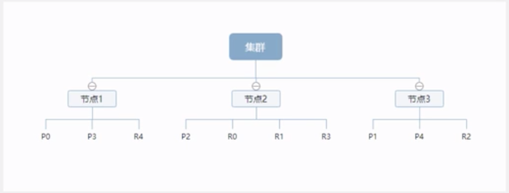

## docker

### 0 命令

```shell
docker images #查看所有镜像
docker image rm ** #删除镜像

docker ps -a #查看所有container
docker rm [containerID] #删除container
docker kill [containerID] #杀死container
docker stop [containerID] 
docker restart [containerID] 

docker container run -p 8000:3000 -it koa-demo /bin/bash
# -it参数:容器的shell映射到当前的shell,你再本机窗口输入的命令,会传入容器.
# -p参数:(-p 3308:3306)容器的 端口映射到本地的端口.

#进入容器
docker attach [containerID] #退出会导致容器终止
docker exec [containerID] #推荐, 退出不会导致容器终止

docker exec -it mysql /bin/bash


```


### 1 mysql

下载镜像: docker pull mysql:5.7

**创建实例并启动**

```shell
docker run -p 3308:3306 --name mysql \
-v /data/mysql/log:/var/log/mysql \
-v /data/mysql/data:/var/lib/mysql \
-v /data/mysql/conf:/etc/mysql \
-e MYSQL_ROOT_PASSWORD=root \
-d mysql:5.7
```

参数说明:

​	-p 3307:3306 将容器的3306 端口映射到主机的3306端口

​	-v /data/mysql/log:/var/log/mysql \  将配置文件夹挂载到主机

​	-v /data/mysql/data:/var/lib/mysql \ 将日志文件挂载到主机

​	-v /data/mysql/conf:/etc/mysql \		将配置文件夹挂载到主机

​	-e MYSQL_ROOT_PASSWORD=root \	初始化root用户的密码


### 2 redis

```shell
mkdir -p /data/redis/conf
touch /data/redis/conf/redis.conf

docker run -p 7001:6379 --name redis \
-v /data/redis/data:/data \
-v /data/redis/conf/redis.conf:/etc/redis/redis.conf \
-d redis redis-server /etc/redis/redis.conf

# 连接redis客户端
docker exec -it redis redis-cli
```


### 3 elasticsearch

```shell
# 下载镜像
docker pull elasticsearch:7.4.2
docker pull kibana:7.4.2

# 创建实例
mkdir -p /data/elasticsearch/config
mkdir -p /data/elasticsearch/data
# 写配置
echo "http.host: 0.0.0.0" >> /data/elasticsearch/config/elasticsearch.properties

# 运行实例 -Xms 限制java占用内存
docker run --name elasticsearch -p 9300:9300 -p 9200:9200 \
-e "discovery.type=single-node" \
-e ES_JAVA_OPT="-Xms64m -Xmx128m" \
-v /data/elasticsearch/config/elasticsearch.yml:/usr/share/elasticsearch/config/elasticsearch.yml \
-v /data/elasticsearch/data:/usr/share/elasticsearch/data \
-v /data/elasticsearch/plugins:/usr/share/elasticsearch/plugins \
-d elasticsearch:7.4.2

```

### 4. Kibana

```shell
docker run --name kibana -e ELASTICSEARCH_HOSTS=http://192.168.88.241:9200 -p 5601:5601 -d kibana:7.4.2
```

### 5. ik分词器

```shell
# 进入es容器内部plugins目录
docker exec -it 容器id /bin/bash
wget ...7.4.2.zip
unzip xxx #解压
rm -rf *.zip
mv elasticsearch/ ik

```


## 技术方案

**SpringCloudAlibaba**

+ Nacos : 注册中心 (服务发现 / 注册)
+ Nacos : 配置中心 (动态配置管理)
+ Ribbon : 负载均衡
+ Feign : 声明式HTTP客户端 (远程调用服务)
+ Sentinel : 服务容错 (限流 , 降级 , 熔断)
+ Gateway : API网关 (webflux 编程模式)
+ Sleuth : 调用链监控
+ Seata : (原 Fescar) 分布式事务解决方案


## nacos

### 注册中心

1. 下载nacos-server 启动 (端口8848)

2. 注册服务pom引入nacos discovery starter

   ```xml
   <dependency>
     <groupId>com.alibaba.cloud</groupId>
     <artifactId>spring-cloud-starter-alibaba-nacos-discovery</artifactId>
   </dependency>
   ```

3. 配置文件中配置 nacos server地址

   spring.cloud.nacos.discovery.server-addr=127.0.0.1:8848

4. 使用@EnableDiscoveryClient 开启服务注册发现功能

5. 用feign测试服务调用


### 配置中心

1. 引入pom

   ```xml
   <dependency>
     <groupId>com.alibaba.cloud</groupId>
     <artifactId>spring-cloud-starter-alibaba-nacos-config</artifactId>
   </dependency>
   ```

2. resources下创建bootstrap.properties 配置文件 配置nacos config元数据

   ```properties
   spring.application.name=gmall-coupon
   spring.cloud.nacos.config.server-addr=127.0.0.1:8848
   ```

3. 完成上述两步后, 应用会从Nacos.config 中获取相应配置, 并添加在Spring Environment 的PropertySources中. 

   ```java
   @Value("${coupon.tom.name:xxx}")
   private String name;
   @Value("${coupon.tom.age:12}")
   private Integer age;
   
   ```

4. 命名空间

   在bootstrap.properties中配置 spring.cloud.nacos.config.namespace=xxxx区别

5. 配置组

   spring.cloud.nacos.config.group=xxx

## Feign

`声明式远程调用`

> Feign 是一个声明式的HTTP客户端. Feign提供了HTTP请求的模板, 通过编写简单的接口和插入注解, 就可定义好HTTP请求的参数, 格式, 地址 等 信息.
>
> Feign 整合了 Ribbon(负载均衡) 和 Hystrix(服务熔断), 可以让我们不再需要显示的使用这2个组件.
>
> SpringCloudFeign 在NetflixFeign 的基础上扩展了 对 SpringMVC注解的支持, 在其实现下, 我们只需创建一个接口并用注解的方式来配置它, 即可完成服务提供方的接口绑定. 简化了SpringCloudRibbon自行封装服务调用客户端的开发量.

1. pom引入

   ```xml
   <dependency>
     <groupId>org.springframework.cloud</groupId>
     <artifactId>spring-cloud-starter-openfeign</artifactId>
   </dependency>
   ```

2. App开启标签 @EnableFeignClients

3. 定义调用接口

   ```java
   @FeignClient("gmall-coupon")
   public interface CouponFeignService {
       @RequestMapping("/coupon/coupon/member/list")
       public R membercoupons();
   }
   ```

4. 使用

   ```java
   @Autowired
   CouponFeignService couponFeignService;
   
   R membercoupons = couponFeignService.membercoupons();
   ```

## Gateway

> 网关作为流量的入口,常用功能包括路由转发,权限校验,限流控制 等, 而springcloud gateway 作为springcloud官方推出的第二代网关框架, 取代了zuul

1. 引入pom

   ```xml
   ## gateway 是使用netty + webflux 实现,因此不需要引入web模块
   <dependency>
     <groupId>org.springframework.cloud</groupId>
     <artifactId>spring-cloud-starter-gateway</artifactId>
   </dependency>
   ```

2. 配置文件

   ```yaml
   spring:
     application:
       name: gmall-gateway
     cloud:
       nacos:
         discovery:
           server-addr: mplane.cn:8848
       gateway:
         routes:
           - id: test_route
             uri: https://www.baidu.com
             predicates:
               - Query=url,baidu
           - id: qq_route
             uri: https://www.qq.com
             predicates:
               - Query=url,qq
   ```

   id : 自定义路由id

   uri : 目标服务地址

   predicates : 路由条件

3. 


## swagger2

1. pom依赖

   ```xml
   <!-- https://mvnrepository.com/artifact/io.springfox/springfox-swagger2 -->
   <dependency>
      <groupId>io.springfox</groupId>
      <artifactId>springfox-swagger2</artifactId>
      <version>2.9.2</version>
   </dependency>
   <!-- https://mvnrepository.com/artifact/io.springfox/springfox-swagger-ui -->
   <dependency>
      <groupId>io.springfox</groupId>
      <artifactId>springfox-swagger-ui</artifactId>
      <version>2.9.2</version>
   </dependency>
   ```

   

2. 配置类

   ```java
   @Configuration //配置类
   @EnableSwagger2// 开启Swagger2的自动配置
   public class SwaggerConfig {  
   }
   ```

### 配置swagger

1. swagger实例bean 是Docket, 所以通过配置Docket实例来配置swagger

   ```java
   @Bean //配置docket以配置Swagger具体参数
   public Docket docket() {
      return new Docket(DocumentationType.SWAGGER_2);
   }
   ```

2. 可以通过apiInfo()属性配置文档信息

   ```java
   //配置文档信息
   private ApiInfo apiInfo() {
      Contact contact = new Contact("联系人名字", "http://xxx.xxx.com/联系人访问链接", "联系人邮箱");
      return new ApiInfo(
              "Swagger学习", // 标题
              "学习演示如何配置Swagger", // 描述
              "v1.0", // 版本
              "http://terms.service.url/组织链接", // 组织链接
              contact, // 联系人信息
              "Apach 2.0 许可", // 许可
              "许可链接", // 许可连接
              new ArrayList<>()// 扩展
     );
   }
   ```

3. Docket实例关联上apiInfo()

   ```java
   @Bean
   public Docket docket() {
      return new Docket(DocumentationType.SWAGGER_2).apiInfo(apiInfo());
   }
   ```


### 增强的swagger ui

> knife4j 
>
> https://doc.xiaominfo.com/knife4j/


## elasticsearch

### 核心概念

> elasticsearch 是面向文档, 关系行数据库 和 elasticsearch 客观对比

| Relational DB     | Elasticsearch  |
| ----------------- | -------------- |
| 数据库 (database) | 索引 (indices) |
| 表 (table)        | 类型 types     |
| 行 (rows)         | 文档 documents |
| 字段 (columns)    | 字段 fields    |

elasticsearch (集群) 中可以包含多个索引 (数据库) , 每个索引中可以包含多个类型 (表) , 每个类型下 又包含多个 文档 (行) , 每个文档中又包含多个字段 (列)


#### **逻辑设计**

一个索引类型中, 包含多个文档, 比如说 文档1 文档2 , 当我们索引一篇文档时, 可以通过这样的 顺序找到他 : 

==索引 -> 类型 -> 文档.==

通过这个组合我们就能索引到某个具体的文档, 注意: ID 不必是整数, 实际上是个字符串

+ **文档 document**

  之前说elasticsearch是面向文档的, 那么就意味着索引和搜索数据的最小单位是文档, elasticsearch 中, 文档有几个重要属性:

  - 自我包含, 一篇文档同时包含字段和对应的值, 也就是同时包含 key:value

  - 可以是层次型的, 一个文档中==包含自文档==, 复杂的逻辑实体就是这么来的

  - 灵活的结构, 文档不依赖预先定义的模式, 我们知道关系型数据库中, 要提前定义字段才能使用, 在elasticsearch 中, 对于字段是非常灵活的, 有时候, 我们可以忽略该字段, 或者动态添加一个新的字段.

  尽管我们可以随意的新增或忽略某个字段, 但是, 每个字段的类型非常重要, 比如一个年龄字段类型, 可以是字符串 也可以是整数, 因为elasticsearch 会保存字段和类型之间的映射以及其他的设置, 这种映射具体到每个映射的每种类型,这也是为什么在elasticsearch中, ==类型有时候也称为映射类型==.

+ **类型 type**

  类型是文档的逻辑容器, 就像关系型数据库一样, 表格是行的容器. 类型中对于字段的定义称为映射, 比如name映射为字符串类型, 我们说文档是无模式的, 他们不需要拥有映射中所定义的所有字段, 比如新增一个字段, 那么elasticsearch 是怎么做的呢? Elasticsearch 会自动将新字段加入映射, 但是这个字段的不确定他是什么类型, elasticsearch就开始猜, 如果这个值是18, 那么elasticsearch会认为他是整形, 但是elasticsearch 也可能猜不对, 所以==最安全的方式就是提前定义好所需要的映射,== 这点跟关系型数据库殊途同归了, 先定义好字段, 然后再使用.

+ **索引 indices**

  索引是映射类型的容器, elasticsearch中的索引是一个非常大的文档集合, 索引存储了映射类型的字段和其他设置. 然后他们被存储到了各个分片上, 


#### **物理设计**  : 节点和分片

elasticsearch 在后台把每个==索引划分成多个分片,== 每个分片可以在集群中的不同服务器间迁移

一个集群至少有一个节点, 而一个节点就是一个 elasticsearch 进程, 节点可以有多个索引默认的, 如果你创建索引, 那么==索引将会有5个分片 (primary shard, 又称 主分片)==构成的, 每一个主分片会有一个副本 (replica shard , 又称复制分片)



上图是一个有3个节点的集群, 可以看到主分片和对应的复制分片都不会再同一个节点内, 这样有利于某个节点挂掉了, 数据也不至于丢失, 实际上, 一个分片是一个Lucene索引, 一个包含 倒排索引的文件目录, 倒排索引的结构使得elasticsearch 在不扫描全部文档的情况下, 就能告诉你哪些文档包含特定的关键字. 

#### **倒排索引**

elasticsearch使用的是一种称为倒排索引的 结构, 采用Lucene 倒排索引作为底层, 这种结构适用于快速的全文搜索, 一个索引由文档中所有不重复的列表构成, 对于每一个词, 都有一个包含他的文档列表, 例如: 现在有两个文档, 每个文档包含如下内容:

> 

为了创建倒排索引, 我们首先要将每个文档拆分成独立的词(词条 或者 tokens),然后创建一个包含所有不重复的词条的排序列表, 然后列出每个词条出现在哪个文档. 


### IK 分词器

分词: 把一段中文或者别的划分成一个个关键字, 我们在搜索的时候会把自己的信息进行分词.==默认的中文分词是将每个字看成一个词==

IK提供了两个分词算法: 

+ Ik_smart : 最少划分
+  ik_max_word  : 最细粒度划分


### Rest风格说明

| method | url地址                         | 描述                 |
| ------ | ------------------------------- | -------------------- |
| PUT    | /索引名/类型名称/文档id         | 创建文档(指定文档id) |
| POST   | /索引名/类型名称                | 创建文档(随机文档id) |
| POST   | /索引名/类型名称/文档id/_update | 修改文档             |
| DELETE | /索引名/类型名称/文档id         | 删除文档             |
| GET    | /索引名/类型名称/文档id         | 查询文档,通过文档id  |
| POST   | /索引名/类型名称/_search        | 查询所有数据         |


### 命令

#### _cat 命令

通过 _cat 可以查看支持的命令

```shell
$ curl localhost:9200/_cat
=^.^=
/_cat/allocation				#每个节点分片数量,占用空间
/_cat/shards						#索引分片信息
/_cat/shards/{index}
/_cat/master						#master节点信息
/_cat/nodes							#node节点信息
/_cat/indices						#索引信息
/_cat/indices/{index}
/_cat/segments					#分片中的分段信息
/_cat/segments/{index}
/_cat/count							#显示索引文档的数量 
/_cat/count/{index}
/_cat/recovery					#正在进行和先前完成的索引碎片恢复的视图
/_cat/recovery/{index}
/_cat/health						#集群健康状况
/_cat/pending_tasks			#正在等待的任务
/_cat/aliases
/_cat/aliases/{alias}
/_cat/thread_pool				#线程池信息
/_cat/plugins						#节点上的插件
/_cat/fielddata
/_cat/fielddata/{fields}
/_cat/nodeattrs					#node节点属性
/_cat/repositories
/_cat/snapshots/{repository}
```

#### verbose

每个命令都支持使用 ?v 参数，来显示==详细的信息==：

```shell
$ curl localhost:9200/_cat/master?v
id                     host      ip        node
QG6QrX32QSi8C3-xQmrSoA 127.0.0.1 127.0.0.1 Manslaughter
```

#### help

每个命令都支持使用help参数，来输出可以显示的列：

```shell
$ curl localhost:9200/_cat/master?help
id   |   | node id
host | h | host name
ip   |   | ip address
node | n | node name
```

#### headers

通过h参数，可以指定输出的字段：

```shell
$ curl localhost:9200/_cat/master?v
id                     host      ip        node
QG6QrX32QSi8C3-xQmrSoA 127.0.0.1 127.0.0.1 Manslaughter

$ curl localhost:9200/_cat/master?h=host,ip,node
127.0.0.1 127.0.0.1 Manslaughter
```

#### 数字类型的格式化

很多的命令都支持返回可读性的大小数字，比如使用mb或者kb来表示

```shell
$ curl localhost:9200/_cat/indices?v
health status index pri rep docs.count docs.deleted store.size pri.store.size
yellow open   test    5   1          3            0      9.2kb          9.2kb
```


### 简单操作

#### 1.  索引 文档 

```shell
#创建索引
PUT /nba

#创建mapping

#创建文档
PUT /nba/jordan/1
{
  "name":"jordan",
  "age":23
}

#更新文档
POST /nba/jordan/1/_update
{
  "doc": {
    "age":133
  }
}

#查询文档
GET /nba/jordan/1

#删除文档
DELETE /nba/jordan/1

```


#### 2. 查询文档

```shell
#查询
GET /nba/jordan/_search?q=name:jack
```


#### 6. bulk 批量 API

```shell
POST customer/external/_bulk
{"index":{"_id":"1"}}
{"name":"tom"}
{"index":{"_id":"2"}}
{"name":"jack"}
 
# bulk API按顺序执行所有的action,如果一个单个的动作因任何原因而失败,他将继续处理后面剩余的动作.当bulk API返回时,将提供每个动作的状态
```

### 进阶检索

#### 1. SearchAPI

ES支持两种基本方式检索

+ 一个是通过使用 REST request URI发送搜索参数 (uri + 检索参数)
+ 一个是通过使用 REST request body 发送 (uri + 请求体)

检索信息

+ 一切检索从search开始

  ```shell
  GET bank/_search		#检索bank下所有信息,包括type 和 docs
  GET bank/_search?q=*&sort=account_number:asc #请求方式检索
  #条件说明
  q=key:value
  sort=key:value
  
  # 响应结果解释
  took #执行时间(毫秒)
  time_out #是否超时
  _shards  #多少个分片被搜索了,以及统计了成功/失败的搜索分片
  hits		 #搜索结果
  hits.total	#搜索结果
  hits.hits		#实际的搜索结果数组(默认为前10的文档)
  sort			#结果的排序 key (没有则按 score 排序 )
  score 和 max_score	#相关性得分和最高得分 (全文检索用)
  ```

  

+ uri + 请求体 进行检索

  ```java
  GET bank/_search
  {
    # 查询条件
    "query": {
      "match_all": {}
    },
    # 排序条件
    "sort":[
      {"account_number": {"order": "desc"}}
    ]
  }
  
  ## 
  ```

#### 2. QueryDSL

> Elasticsearch 提供了一个可以执行查询的Json风格的DSL ( domain-specific language 领域特定语言) . 这个被称为 QueryDSL .  

##### 基本用法

```shell
# sort 排序
# 不指定sort 默认按score降序排列
GET bank/_search
{
  "query": {
    "match_all": {}
  },
  "sort": [
    {"age": "asc","balance": "asc"}
  ]
}

# from size 分页
GET bank/_search
{
  "query": {
    "match_all": {}
  },
  "from":0,
  "size":10
}

# _source 返回字段
GET bank/_search
{
  "query": {
    "match_all": {}
  },
  "_source":["age","balance"]
}
```


##### match

```shell
# match [匹配查询]
## 基本类型(非字符串),精确匹配
GET bank/_search
{
  "query": {
    "match": {
      "account_number": "20"
    }
  }
}

## 字符串,全文检索
## 默认按score排序
GET bank/_search
{
  "query": {
    "match": {
      "address": "Kings"
    }
  }
}

```

##### match_phrase 

```shell
## 短语匹配
## 将需要匹配的值当成一个整体单词(不分词) 进行检索
## 查出address 中包含 mill road 的所有记录,并给出相关性得分
GET bank/_search
{
  "query": {
    "match_phrase": {
      "address": "mill lane"
    }
  }
}

```

##### multi_match 

```shell
## 多字段匹配
## state 或 address包含 mill
GET bank/_search
{
  "query": {
    "multi_match": {
      "query": "mill",
      "fields":["state","address"]
    }
  }
}
```

##### bool

```shell
## 复合查询
## 复合语句可以合并任何其他查询语句,包括复合语句
## 复合语句之间可以互相嵌套,可以表达非常复杂的逻辑

## must: 必须达到must列举的所有条件
GET /bank/_search
{
  "query": {
    "bool": {
      "must": [
        {
          "match": {"gender": "F"}
        },
        {
          "match": {"address": "mill"}
        }
      ]
    }
  }
}

## must_not : 必须不满足must条件
## should: 不满足也行
```

##### filter

```shell
## 结果过滤
## 并不是所有的查询都需要产生分数,特别是那些仅用于"filtering"(过滤)的文档.为了不计算分数 ES 会自动检查场景并且优化查询的执行.


```

##### term

```shell
## 和match一样 匹配某个属性的值 全文检索字段用match, 其他非text字段匹配用term
```


##### aggregate

```shell
## 执行聚合
## 聚合提供了从数据分组和提取数据的能力. 最简单的聚合方法大致等于SQL GROUP BY和SQL聚合函数. 在ES中,您有执行搜索返回hits(命中结果), 并且同时返回聚合结果, 把一个响应中的所有hits(命中结果)分隔开的能力. 这是非常强大且有效的, 您可以执行查询和多个聚合,并且在一次使用中得到各自的返回结果, 使用一次简洁和简化的API来避免网络往返.

# 搜索address 中包含mill 的所有人的年龄分布以及平均年龄, 但不显示这些人的详情
GET /bank/_search
{
  "query": {
    "match": {
      "address": "mill"
    }
  },
  "aggs": {
    "group_by_state": {
      "terms": {
        "field": "age"
      }
    },
    "avg_age":{
      "avg": { 
        "field": "age"
      }
    }
  }
}

```

#### 3. Mapping

##### 1. 字段类型

```shell
# 核心类型
字符串(string) 
		text,keyword
数字类型	
		(Num)long,integer,short,byte,double,float,half_float,scaled_float
日期类型(Date) 
		date
布尔类型(Boolean)
		boolean
二进制类型(binary)
		binary

# 复合类型
数组类型(Array)
		Array 支持不针对特定的类型
对象类型(Object)
		object用于单JSON对象
嵌套类型(Nested)
		nested用于JSON对象
		
# 地理类型(GEO)
地理坐标(Geo-point)
		geo_point 用于描述经纬度坐标
地理图形(Geo-shape)
		geo_shape 用于秒速复杂形状,如多边形
	
# 特定类型
IP类型
		ip 用于描述ipv4 ipv6
不全类型(Completion)
		completion 提供自动完成提示
令牌计数类型(Token count)
		token_count用于统计字符串中的词条数量
附件类型(attachment)
		参考 mapper-attachements 插件,支持将附件如 Microsoft Office格式,Epub ..索引为 attachment 数据类型

抽取类型(Percolator)
		接受特点领域语言(query-dsl)的查询

# 多字段
通常用于为不同目的用不同的方法索引一个字段. 例如:string字段可以映射为一个text字段用于全文检索. 同样可以映射为一个keyword 字段用于排序和聚合. 另外, 你可以使用standard analyzer, English analyzer, french analyzer 来索引一个text字段
这就是 muti-fields的目的. 大多数的数据类型通过fields参数来支持 muti-fields
```

##### 2. 映射

Mapping 是用来定义一个文档(document) , 以及它所包含的属性(field) 是如何存储和索引的. 比如, 使用mapping来定义 :

+ 哪些字符串属性应该被看做全文本属性
+ 哪些属性包含数字,日期或者地理位置
+ 文档中的所有属性是否都能被索引 ( _all 配置 )
+ 日期的格式
+ 自定义映射规则来执行动态添加属性
+ 查看mapping 信息
+ 修改mapping 信息

 ```shell
# 创建映射
PUT bank
{
  "mappings":{
    "properties":{
      "age":{"type":"integer"},
      "email":{"type":"keyword"},
      "name":{"type":"text"}
    }
  }
}

# 添加新的字段映射
PUT bank/_mapping
{
  "properties":{
    "employee-id":{"type":"keyword","index":false}
  }
}

# 对于已经存在的映射字段,不能更新. 必须创建新的索引进行数据迁移

# 数据迁移
## 先创建出 new_twitter 的正确映射. 然后使用如下方式迁移
POST _reindex
{
  "source": {
    "index": "twitter"
  },
  "dest": {
    "index": "new_twitter"
  }
}

 ```

#### 4. 分词

> 一个tokenizer ( 分词器 ) 接收一个字符流, 将之分割为独立的 tokens ( 词元, 通常是独立的单词 ), 然后输出 tokens 流.
>
> 例如, whitespace 遇到空白字符时分割文本. 它会将文本 "Quick brown fox!"分割为[Quick , brown , fox!].
>
> 该tokenizer 还负责记录各个term(词条) 的顺序或 position (用于phrase短语 和 Word proximity 词近邻查询), 以及term 所代表的原始 word 的start 和 end 的character offsets(字符偏移量) .
>
> ES提供了很多内置的分词器, 可以用来构建custom analyzers(自定义分词器)

测试分词器

```shell
POST _analyze
{
  "analyzer": "ik_smart",
  "text": "我是一个程序员!"
}
```


### 整合springboot

**elasticsearch-rest-high-level-client** 官方推荐client

```xml
#pom
<!--es rest client-->
<properties>
  <elasticsearch.version>7.4.2</elasticsearch.version>
</properties>

<dependency>
  <groupId>org.elasticsearch.client</groupId>
  <artifactId>elasticsearch-rest-high-level-client</artifactId>
  <version>7.4.2</version>
</dependency>
```

```java
// 配置文件
@Configuration
public class ESconfig {
    @Bean
    public RestHighLevelClient restHighLevelClient(){
        RestClientBuilder builder = RestClient.builder(new HttpHost("127.0.0.1", 9200, "http"));
        return new RestHighLevelClient(builder);
    }
}
```


### 商品spu es 存储模型

```json
## 设置mapping
PUT product
{
  "mappings": {
    "properties": {
      "skuId":{"type":"long"},
      "spuId":{"type":"keyword"},
      "skuTitle":{"type":"text","analyzer": "ik_smart"},
      "skuPrice":{"type":"keyword"},
      "skuImg":{"type":"keyword","index": false,"doc_values": false},
      "saleCount":{"type":"long"},
      "hasStock":{"type":"boolean"},
      "hotScore":{"type":"long"},
      "brandId":{"type":"long"},
      "categoryId":{"type":"long"},
      "brandName":{"type":"keyword","index": false,"doc_values": false},
      "brandImg":{"type":"keyword","index": false,"doc_values": false},
      "categoryName":{"type":"keyword","index": false,"doc_values": false},
      "attrs":{
        "type": "nested",
        "properties": {
          "attrId":{"type":"long"},
          "attrName":{"type":"keyword","index": false,"doc_values": false},
          "attrValue":{"type":"keyword"}
        }
      }
    }
  }
}
```


## 配置nginx

```conf
# 域名 指向网关
http {
	#上游服务器
	upstream mp{
		server 127.0.0.1:88;
	}
}

server{
	listen	80;
	server_name	mp.com;
	location / {
		proxy_set_header Host $host;
		proxy_pass	http://mp.com;
	}
}
```


## 异步编程 CompletbaleFutue

 Future是Java 5添加的类，用来描述一个异步计算的结果。你可以使用`isDone`方法检查计算是否完成，或者使用`get`阻塞住调用线程，直到计算完成返回结果，你也可以使用`cancel`方法停止任务的执行。

虽然`Future`以及相关使用方法提供了异步执行任务的能力，但是对于结果的获取却是很不方便，只能通过阻塞或者轮询的方式得到任务的结果。阻塞的方式显然和我们的异步编程的初衷相违背，轮询的方式又会耗费无谓的CPU资源，而且也不能及时地得到计算结果，为什么不能用观察者设计模式当计算结果完成及时通知监听者呢？

很多语言，比如Node.js，采用回调的方式实现异步编程。Java的一些框架，比如Netty，自己扩展了Java的 `Future`接口，提供了`addListener`等多个扩展方法；Google guava也提供了通用的扩展Future；Scala也提供了简单易用且功能强大的Future/Promise异步编程模式。

作为正统的Java类库，是不是应该做点什么，加强一下自身库的功能呢？

在Java 8中, 新增加了一个包含50个方法左右的类: CompletableFuture，提供了非常强大的Future的扩展功能，可以帮助我们简化异步编程的复杂性，提供了函数式编程的能力，可以通过回调的方式处理计算结果，并且提供了转换和组合CompletableFuture的方法。

CompletableFuture类实现了Future接口，所以你还是可以像以前一样通过`get`方法阻塞或者轮询的方式获得结果，但是这种方式不推荐使用。

CompletableFuture和FutureTask同属于Future接口的实现类，都可以获取线程的执行结果。


### 1.   创建异步对象

CompletableFuture 提供了四个静态方法来创建一个异步操作。

```java
static CompletableFuture<Void> runAsync(Runnable runnable)
public static CompletableFuture<Void> runAsync(Runnable runnable, Executor executor)
public static <U> CompletableFuture<U> supplyAsync(Supplier<U> supplier)
public static <U> CompletableFuture<U> supplyAsync(Supplier<U> supplier, Executor executor)
```

**没有指定Executor的方法会使用ForkJoinPool.commonPool() 作为它的线程池执行异步代码**。如果指定线程池，则使用指定的线程池运行。以下所有的方法都类同。

- runAsync方法不支持返回值。
- supplyAsync可以支持返回值。


### 2.   计算完成时回调方法

当CompletableFuture的计算结果完成，或者抛出异常的时候，可以执行特定的Action。主要是下面的方法：

```java
public CompletableFuture<T> whenComplete(BiConsumer<? super T,? super Throwable> action);
public CompletableFuture<T> whenCompleteAsync(BiConsumer<? super T,? super Throwable> action);
public CompletableFuture<T> whenCompleteAsync(BiConsumer<? super T,? super Throwable> action, Executor executor);

public CompletableFuture<T> exceptionally(Function<Throwable,? extends T> fn);
```

whenComplete可以处理正常和异常的计算结果，exceptionally处理异常情况。BiConsumer<? super T,? super Throwable>可以定义处理业务

whenComplete 和 whenCompleteAsync 的区别：
		whenComplete：是执行当前任务的线程执行继续执行 whenComplete 的任务。
		whenCompleteAsync：是执行把 whenCompleteAsync 这个任务继续提交给线程池来进行执行。

**方法不以Async结尾，意味着Action使用相同的线程执行，而Async可能会使用其他线程执行（如果是使用相同的线程池，也可能会被同一个线程选中执行）**


代码示例：

```java
public class CompletableFutureDemo {

    public static void main(String[] args) throws ExecutionException, InterruptedException {
        CompletableFuture future = CompletableFuture.supplyAsync(new Supplier<Object>() {
            @Override
            public Object get() {
                System.out.println(Thread.currentThread().getName() + "\t completableFuture");
                int i = 10 / 0;
                return 1024;
            }
        }).whenComplete(new BiConsumer<Object, Throwable>() {
            @Override
            public void accept(Object o, Throwable throwable) {
                System.out.println("-------o=" + o.toString());
                System.out.println("-------throwable=" + throwable);
            }
        }).exceptionally(new Function<Throwable, Object>() {
            @Override
            public Object apply(Throwable throwable) {
                System.out.println("throwable=" + throwable);
                return 6666;
            }
        });
        System.out.println(future.get());
    }
}


CompletableFuture.supplyAsync(()->{
            System.out.println("run supplyAsync");
            int i = 1 / 0;
            return "hello async";
        }).whenComplete((t,u)->{
            System.out.println("t -> "+t);
            System.out.println("u -> "+u);
        }).exceptionally((e)->{
            System.out.println("e -> "+e);
            return e.toString();
        });
```


### 3.  handle 方法

handle 是执行**任务完成时**对结果的处理。
handle 是在任务完成后再执行，还可以处理异常的任务。

```java
public <U> CompletionStage<U> handle(BiFunction<? super T, Throwable, ? extends U> fn);
public <U> CompletionStage<U> handleAsync(BiFunction<? super T, Throwable, ? extends U> fn);
public <U> CompletionStage<U> handleAsync(BiFunction<? super T, Throwable, ? extends U> fn,Executor executor);
```


### 4.   线程串行化方法

thenApply 方法：当一个线程依赖另一个线程时，获取上一个任务返回的结果，并返回当前任务的返回值。

thenAccept方法：消费处理结果。接收任务的处理结果，并消费处理，无返回结果。

thenRun方法：只要上面的任务执行完成，就开始执行thenRun，只是处理完任务后，执行 thenRun的后续操作

带有Async默认是异步执行的。这里所谓的异步指的是不在当前线程内执行。

```java
public <U> CompletableFuture<U> thenApply(Function<? super T,? extends U> fn)
public <U> CompletableFuture<U> thenApplyAsync(Function<? super T,? extends U> fn)
public <U> CompletableFuture<U> thenApplyAsync(Function<? super T,? extends U> fn, Executor executor)

public CompletionStage<Void> thenAccept(Consumer<? super T> action);
public CompletionStage<Void> thenAcceptAsync(Consumer<? super T> action);
public CompletionStage<Void> thenAcceptAsync(Consumer<? super T> action,Executor executor);

public CompletionStage<Void> thenRun(Runnable action);
public CompletionStage<Void> thenRunAsync(Runnable action);
public CompletionStage<Void> thenRunAsync(Runnable action,Executor executor);
```

Function<? super T,? extends U>
		T：上一个任务返回结果的类型
		U：当前任务的返回值类型

代码演示：

```java
public static void main(String[] args) throws ExecutionException, InterruptedException {
    CompletableFuture<Integer> future = CompletableFuture.supplyAsync(new Supplier<Integer>() {
        @Override
        public Integer get() {
            System.out.println(Thread.currentThread().getName() + "\t completableFuture");
            //int i = 10 / 0;
            return 1024;
        }
    }).thenApply(new Function<Integer, Integer>() {
        @Override
        public Integer apply(Integer o) {
            System.out.println("thenApply方法，上次返回结果：" + o);
            return  o * 2;
        }
    }).whenComplete(new BiConsumer<Integer, Throwable>() {
        @Override
        public void accept(Integer o, Throwable throwable) {
            System.out.println("-------o=" + o);
            System.out.println("-------throwable=" + throwable);
        }
    }).exceptionally(new Function<Throwable, Integer>() {
        @Override
        public Integer apply(Throwable throwable) {
            System.out.println("throwable=" + throwable);
            return 6666;
        }
    }).handle(new BiFunction<Integer, Throwable, Integer>() {
        @Override
        public Integer apply(Integer integer, Throwable throwable) {
            System.out.println("handle o=" + integer);
            System.out.println("handle throwable=" + throwable);
            return 8888;
        }
    });
    System.out.println(future.get());
}
```


### 5. 两任务组合 - 都要完成

两个任务必须都完成，触发该任务。

thenCombine：组合两个future，获取两个future的返回结果，并返回当前任务的返回值

thenAcceptBoth：组合两个future，获取两个future任务的返回结果，然后处理任务，没有返回值。

runAfterBoth：组合两个future，不需要获取future的结果，只需两个future处理完任务后，处理该任务。

```java
public <U,V> CompletableFuture<V> thenCombine(
    CompletionStage<? extends U> other,
    BiFunction<? super T,? super U,? extends V> fn);

public <U,V> CompletableFuture<V> thenCombineAsync(
    CompletionStage<? extends U> other,
    BiFunction<? super T,? super U,? extends V> fn);

public <U,V> CompletableFuture<V> thenCombineAsync(
    CompletionStage<? extends U> other,
    BiFunction<? super T,? super U,? extends V> fn, Executor executor);
    

public <U> CompletableFuture<Void> thenAcceptBoth(
    CompletionStage<? extends U> other,
    BiConsumer<? super T, ? super U> action);

public <U> CompletableFuture<Void> thenAcceptBothAsync(
    CompletionStage<? extends U> other,
    BiConsumer<? super T, ? super U> action);

public <U> CompletableFuture<Void> thenAcceptBothAsync(
    CompletionStage<? extends U> other,
    BiConsumer<? super T, ? super U> action, Executor executor);


public CompletableFuture<Void> runAfterBoth(CompletionStage<?> other,
                                            Runnable action);

public CompletableFuture<Void> runAfterBothAsync(CompletionStage<?> other,
                                                 Runnable action);

public CompletableFuture<Void> runAfterBothAsync(CompletionStage<?> other,
                                                 Runnable action,
                                                 Executor executor);
```

测试案例：

```java
public static void main(String[] args) {
    CompletableFuture.supplyAsync(() -> {
        return "hello";
    }).thenApplyAsync(t -> {
        return t + " world!";
    }).thenCombineAsync(CompletableFuture.completedFuture(" CompletableFuture"), (t, u) -> {
        return t + u;
    }).whenComplete((t, u) -> {
        System.out.println(t);
    });
}
```

输出：hello world! CompletableFuture


### 6.   两任务组合 - 一个完成

当两个任务中，任意一个future任务完成的时候，执行任务。

applyToEither：两个任务有一个执行完成，获取它的返回值，处理任务并有新的返回值。

acceptEither：两个任务有一个执行完成，获取它的返回值，处理任务，没有新的返回值。

runAfterEither：两个任务有一个执行完成，不需要获取future的结果，处理任务，也没有返回值。

```java
public <U> CompletableFuture<U> applyToEither(
    CompletionStage<? extends T> other, Function<? super T, U> fn);

public <U> CompletableFuture<U> applyToEitherAsync(
    CompletionStage<? extends T> other, Function<? super T, U> fn);

public <U> CompletableFuture<U> applyToEitherAsync(
    CompletionStage<? extends T> other, Function<? super T, U> fn,
    Executor executor);

public CompletableFuture<Void> acceptEither(
    CompletionStage<? extends T> other, Consumer<? super T> action);

public CompletableFuture<Void> acceptEitherAsync(
    CompletionStage<? extends T> other, Consumer<? super T> action);

public CompletableFuture<Void> acceptEitherAsync(
    CompletionStage<? extends T> other, Consumer<? super T> action,
    Executor executor);

public CompletableFuture<Void> runAfterEither(CompletionStage<?> other,
                                              Runnable action);

public CompletableFuture<Void> runAfterEitherAsync(CompletionStage<?> other,
                                                   Runnable action);

public CompletableFuture<Void> runAfterEitherAsync(CompletionStage<?> other,
                                                   Runnable action,
                                                   Executor executor);
```


### 7.   多任务组合

```java
public static CompletableFuture<Void> allOf(CompletableFuture<?>... cfs);

public static CompletableFuture<Object> anyOf(CompletableFuture<?>... cfs);
```

allOf：等待所有任务完成

anyOf：只要有一个任务完成


```java
public static void main(String[] args) {
    List<CompletableFuture> futures = Arrays.asList(CompletableFuture.completedFuture("hello"),
                                                    CompletableFuture.completedFuture(" world!"),
                                                    CompletableFuture.completedFuture(" hello"),
                                                    CompletableFuture.completedFuture("java!"));
    final CompletableFuture<Void> allCompleted = CompletableFuture.allOf(futures.toArray(new CompletableFuture[]{}));
    allCompleted.thenRun(() -> {
        futures.stream().forEach(future -> {
            try {
                System.out.println("get future at:"+System.currentTimeMillis()+", result:"+future.get());
            } catch (InterruptedException | ExecutionException e) {
                e.printStackTrace();
            }
        });
    });
}
```

测试结果：

```
get future at:1568892339473, result:hello
get future at:1568892339473, result: world!
get future at:1568892339473, result: hello
get future at:1568892339473, result:java!
```

几乎同时完成任务！


### 8.   优化商品详情页

```java
@Service
public class ItemServiceImpl implements ItemService {

    @Autowired
    private GmallPmsFeign pmsFeign;

    @Autowired
    private GmallSmsFeign smsFeign;

    @Autowired
    private GmallWmsFeign wmsFeign;

    @Autowired
    private ThreadPoolExecutor threadPoolExecutor;


    @Override
    public ItemVO loadData(Long skuId) throws ExecutionException, InterruptedException {

        ItemVO itemVO = new ItemVO();

        // 1. 获取sku的基本信息
        // 后续获取sku的促销信息、spu的销售属性和spu详情信息（需要sku中的spuId）都需要skuInfoEntity
        // supplyAsync有返回值
        // runAsync无返回值
        // 所以这里需要使用supplyAsync
        CompletableFuture<SkuInfoEntity> skuFuture = CompletableFuture.supplyAsync(() -> {
            Resp<SkuInfoEntity> skuInfoEntityResp = this.pmsFeign.querySkuById(skuId);
            SkuInfoEntity skuInfoEntity = skuInfoEntityResp.getData();
            if (skuInfoEntity != null) {
                BeanUtils.copyProperties(skuInfoEntity, itemVO);
            }
            return skuInfoEntity;
        }, threadPoolExecutor);


        // 2. 获取sku的图片信息
        CompletableFuture<Void> skuImageFuture = CompletableFuture.runAsync(() -> {
            Resp<List<SkuImagesEntity>> listResp = this.pmsFeign.queryImagesBySkuId(skuId);
            List<SkuImagesEntity> images = listResp.getData();
            if (!CollectionUtils.isEmpty(images)) {
                List<String> imageUrls = images.stream().map(image -> image.getImgUrl()).collect(Collectors.toList());
                itemVO.setPics(imageUrls);
            }
        }, threadPoolExecutor);


        // 3. 获取sku的促销信息 TODO

        // 4. 获取spu的所有销售属性
        // thenAcceptAsync：有参数，无返回
        // thenApplyAsync: 有参数，有返回
        // 后续spu详情也需要skuInfoEntity中的spuId，所以这里使用thenApplyAsync
        CompletableFuture<SkuInfoEntity> spuFuture = skuFuture.thenApplyAsync(skuInfoEntity -> {
            Resp<List<SkuSaleAttrValueEntity>> skuSaleAttrValueResp = this.pmsFeign.querySkuSaleAttrValueBySpuId(skuInfoEntity.getSpuId());
            List<SkuSaleAttrValueEntity> skuSaleAttrValueEntities = skuSaleAttrValueResp.getData();
            itemVO.setSaleAttrs(skuSaleAttrValueEntities);
            return skuInfoEntity;
        }, threadPoolExecutor);

        // 5. 获取规格参数组及组下的规格参数 TODO

        // 6. spu详情 TODO

        CompletableFuture<Void> future = CompletableFuture.allOf(skuFuture, skuImageFuture, spuFuture);
        // 阻塞主进程，等待子进程全部执行完毕！
        future.get();

        return itemVO;
    }


}
```


## 缓存 spring cache

缓存常见的3个问题

1. **缓存穿透 ** 是指查询一个  **不存在的数据**  ，由于缓存无法命中，将去查询数据库，但是数据库也无此记录，并且出于容错考虑，我们没有将这次查询的null写入缓存，这将导致这个不存在的数据每次请求都要到存储层去查询，失去了缓存的意义。在流量大时，可能DB就挂掉了，要是有人利用不存在的key频繁攻击我们的应用，这就是**漏洞**。

   解决：空结果也进行缓存，但它的过期时间会很短，最长不超过五分钟。

2. **缓存雪崩 ** 是指在我们设置缓存时采用了  **相同的过期时间**，导致缓存在某一时刻同时失效，请求全部转发到DB，DB瞬时压力过重雪崩。

   解决：原有的失效时间基础上增加一个随机值，比如1-5分钟随机，这样每一个缓存的过期时间的重复率就会降低，就很难引发集体失效的事件。

3. **缓存击穿 ** 是指对于一些设置了过期时间的key，如果这些key可能会在某些时间点被超高并发地访问，是一种非常“热点”的数据。这个时候，需要考虑一个问题：如果这个key在大量请求同时进来之前正好失效，那么所有对这个key的数据查询都落到db，我们称为缓存击穿。

   与缓存雪崩的区别：

   1. 击穿是一个热点key失效
   2. 雪崩是很多key集体失效

   解决：锁


### Spring cache

#### 缓存数据一致性-解决方案

无论是双写模式还是失效模式, 都会导致缓存的不一致问题, 即多个实例同事更新会出事. 怎么办?

+ 如果是用户维度数据(订单数据, 用户数据) , 这种并发几率非常小, 不用考虑这个问题, 缓存数据加上过期时间, 每隔一段时间出发读的主动更新即可
+ 如果是菜单, 商品介绍等基础数据, 也可以去使用canal 订阅 binlog 的方式
+ 缓存数据 + 过期时间 也足够解决大部分对于缓存的需求
+ 通过加锁保证并发读写, 写写的时候按顺序排队. 读读无所谓 . 所以适合使用读写锁.(业务不关心脏数据 , 允许临时脏数据 可忽略)

总结:

+ 我们能放入缓存的数据本就不应该是实时性, 一致性要求超高的. 所以缓存数据的时候加上过期时间, 保证每天拿到当前最新数据即可
+ 我们不应该过度设计, 增加系统的复杂性
+ 遇到实时性, 一致性要求高的数据, 就应该查数据库, 即使慢点.


### JSR 107 

Java Caching定义了5个核心接口，分别是CachingProvider, CacheManager, Cache, Entry 和 Expiry。

+ CachingProvider定义了创建、配置、获取、管理和控制多个CacheManager。一个应用可 以在运行期访问多个CachingProvider。
+ CacheManager定义了创建、配置、获取、管理和控制多个唯一命名的Cache，这些Cache 存在于CacheManager的上下文中。一个CacheManager仅被一个CachingProvider所拥有。
+ Cache是一个类似Map的数据结构并临时存储以Key为索引的值。一个Cache仅被一个 CacheManager所拥有。
+ Entry是一个存储在Cache中的key-value对。
+ Expiry 每一个存储在Cache中的条目有一个定义的有效期。一旦超过这个时间，条目为过期 的状态。一旦过期，条目将不可访问、更新和删除。缓存有效期可以通过ExpiryPolicy设置。


### spring 缓存抽象

Spring从3.1开始定义了org.springframework.cache.Cache 和 org.springframework.cache.CacheManager接口来统一不同的缓存技术；并支持使用JCache（JSR-107）注解简化我们开发；

+ Cache接口为缓存的组件规范定义，包含缓存的各种操作集合；
+ Cache接口下Spring提供了各种xxxCache的实现；如RedisCache，EhCacheCache , ConcurrentMapCache等；
+ 每次调用需要缓存功能的方法时，Spring会检查检查指定参数的指定的目标方法是否 已经被调用过；如果有就直接从缓存中获取方法调用后的结果，如果没有就调用方法 并缓存结果后返回给用户。下次调用直接从缓存中获取。
+ 使用Spring缓存抽象时我们需要关注以下两点；
  1. 确定方法需要被缓存以及他们的缓存策略
  2. 从缓存中读取之前缓存存储的数据


### 相关注解

spring boot cache 提供了一些注解方便做cache应用。

1. @CacheConfig:主要用于配置该类中会用到的一些共用的缓存配置
2. @Cacheable:  主要方法返回值加入缓存。同时在查询时，会先从缓存中取，若不存在才再发起对数据库的访问。
3. @CachePut:    配置于函数上，能够根据参数定义条件进行缓存，与@Cacheable不同的是，每次回真实调用函数，所以主要用于数据  **新增和修改**  操作上。
4. @CacheEvict:   配置于函数上，通常用在  **删除**  方法上，用来从缓存中移除对应数据
5. @Caching:   配置于函数上，组合多个Cache注解使用。


### @Cacheable

>  @Cacheable 的作用 主要针对方法配置，能够根据方法的请求参数对其结果进行缓存

- `value`、`cacheNames`：两个等同的参数（`cacheNames`为Spring 4新增，作为`value`的别名），用于指定缓存存储的集合名。由于Spring 4中新增了`@CacheConfig`，因此在Spring 3中原本必须有的`value`属性，也成为非必需项了
- `key`：缓存对象存储在Map集合中的key值，非必需，缺省按照函数的所有参数组合作为key值，若自己配置需使用SpEL表达式，比如：`@Cacheable(key = "#p0")`：使用函数第一个参数作为缓存的key值，更多关于SpEL表达式的详细内容可参考[官方文档](http://docs.spring.io/spring/docs/current/spring-framework-reference/html/cache.html#cache-spel-context)
- `condition`：缓存对象的条件，非必需，也需使用SpEL表达式，只有满足表达式条件的内容才会被缓存，比如：`@Cacheable(key = "#p0", condition = "#p0.length() < 3")`，表示只有当第一个参数的长度小于3的时候才会被缓存，若做此配置上面的AAA用户就不会被缓存，读者可自行实验尝试。
- `unless`：另外一个缓存条件参数，非必需，需使用SpEL表达式。它不同于`condition`参数的地方在于它的判断时机，该条件是在函数被调用之后才做判断的，所以它可以通过对result进行判断。
- `keyGenerator`：用于指定key生成器，非必需。若需要指定一个自定义的key生成器，我们需要去实现`org.springframework.cache.interceptor.KeyGenerator`接口，并使用该参数来指定。需要注意的是：**该参数与`key`是互斥的**
- `cacheManager`：用于指定使用哪个缓存管理器，非必需。只有当有多个时才需要使用
- `cacheResolver`：用于指定使用那个缓存解析器，非必需。需通过`org.springframework.cache.interceptor.CacheResolver`接口来实现自己的缓存解析器，并用该参数指定。

#### 作用和配置方法

| 参数      | 解释                                                         | example                                                      |
| :-------- | :----------------------------------------------------------- | :----------------------------------------------------------- |
| value     | 缓存的名称，在 spring 配置文件中定义，必须指定至少一个       | 例如: @Cacheable(value=”mycache”) @Cacheable(value={”cache1”,”cache2”} |
| key       | 缓存的 key，可以为空，如果指定要按照 SpEL 表达式编写，如果不指定，则缺省按照方法的所有参数进行组合 | @Cacheable(value=”testcache”,key=”#userName”)                |
| condition | 缓存的条件，可以为空，使用 SpEL 编写，返回 true 或者 false，只有为 true 才进行缓存 | @Cacheable(value=”testcache”,condition=”#userName.length()>2”) |

```java
/** * 根据ID获取Tasklog */
@Cacheable(value = CACHE_KEY, key = "#id",condition = "#result != null")
public Tasklog findById(String id){
  System.out.println("FINDBYID");
  System.out.println("ID:"+id);
  return taskLogMapper.selectById(id);
}
```


### @CachePut

> @CachePut 的作用 主要针对方法配置，能够根据方法的请求参数对其结果进行缓存，和 @Cacheable 不同的是，它每次都会触发真实方法的调用

####   作用和配置方法

| 参数      | 解释                                                         | example                                                      |
| :-------- | :----------------------------------------------------------- | :----------------------------------------------------------- |
| value     | 缓存的名称，在 spring 配置文件中定义，必须指定至少一个       | @CachePut(value=”my cache”)                                  |
| key       | 缓存的 key，可以为空，如果指定要按照 SpEL 表达式编写，如果不指定，则缺省按照方法的所有参数进行组合 | @CachePut(value=”testcache”,key=”#userName”)                 |
| condition | 缓存的条件，可以为空，使用 SpEL 编写，返回 true 或者 false，只有为 true 才进行缓存 | @CachePut(value=”testcache”,condition=”#userName.length()>2”) |

```java
/** * 添加tasklog * @param tasklog * @return */
@CachePut(value = CACHE_KEY, key = "#tasklog.id")
public Tasklog create(Tasklog tasklog){
  System.out.println("CREATE");
  System.err.println (tasklog);
  taskLogMapper.insert(tasklog);
  return tasklog;
}
```


### @CacheEvict

>  @CachEvict 的作用 主要针对方法配置，能够根据一定的条件对缓存进行清空

####   作用和配置方法

| 参数             | 解释                                                         | example                                                      |
| :--------------- | :----------------------------------------------------------- | :----------------------------------------------------------- |
| value            | 缓存的名称，在 spring 配置文件中定义，必须指定至少一个       | @CacheEvict(value=”my cache”)                                |
| key              | 缓存的 key，可以为空，如果指定要按照 SpEL 表达式编写，如果不指定，则缺省按照方法的所有参数进行组合 | @CacheEvict(value=”testcache”,key=”#userName”)               |
| condition        | 缓存的条件，可以为空，使用 SpEL 编写，返回 true 或者 false，只有为 true 才进行缓存 | @CacheEvict(value=”testcache”,condition=”#userName.length()>2”) |
| allEntries       | 是否清空所有缓存内容，缺省为 false，如果指定为 true，则方法调用后将立即清空所有缓存 | @CachEvict(value=”testcache”,allEntries=true)                |
| beforeInvocation | 是否在方法执行前就清空，缺省为 false，如果指定为 true，则在方法还没有执行的时候就清空缓存，缺省情况下，如果方法执行抛出异常，则不会清空缓存 | @CachEvict(value=”testcache”，beforeInvocation=true)         |

```java
/** * 根据ID删除Tasklog * @param id */
@CacheEvict(value = CACHE_KEY, key = "#id")
public void delete(String id){
  System.out.println("DELETE");
  System.out.println("ID:"+id);
  taskLogMapper.deleteById(id);
}
```


### @CacheConfig

所有的@Cacheable（）里面都有一个value＝“xxx”的属性，这显然如果方法多了，写起来也是挺累的，如果可以一次性声明完 那就省事了， 所以，有了@CacheConfig这个配置，@CacheConfig is a class-level annotation that allows to share the cache names，如果你在你的方法写别的名字，那么依然以方法的名字为准。

@CacheConfig是一个类级别的注解。

```java
/** * 测试服务层 */
@Service
@CacheConfig(value = "taskLog")
public class TaskLogService {
 
    @Autowired  private TaskLogMapper taskLogMapper;
    @Autowired  private net.sf.ehcache.CacheManager cacheManager;
 
    /** * 缓存的key */
    public static final String CACHE_KEY   = "taskLog";
 
    /** * 添加tasklog * @param tasklog * @return */
    @CachePut(key = "#tasklog.id")
    public Tasklog create(Tasklog tasklog){
        System.out.println("CREATE");
        System.err.println (tasklog);
        taskLogMapper.insert(tasklog);
        return tasklog;
    }
 
    /** * 根据ID获取Tasklog * @param id * @return */
    @Cacheable(key = "#id")
    public Tasklog findById(String id){
        System.out.println("FINDBYID");
        System.out.println("ID:"+id);
        return taskLogMapper.selectById(id);
    }
}
```


### @Caching

有时候我们可能组合多个Cache注解使用；比如用户新增成功后，我们要添加id–>user；username—>user；email—>user的缓存；此时就需要@Caching组合多个注解标签了。 

```java
@Caching(put = {
@CachePut(value = "user", key = "#user.id"),
@CachePut(value = "user", key = "#user.username"),
@CachePut(value = "user", key = "#user.email")
})
public User save(User user) {
}
```


### 自定义缓存注解

比如之前的那个@Caching组合，会让方法上的注解显得整个代码比较乱，此时可以使用自定义注解把这些注解组合到一个注解中，如：

```java
@Caching(put = {
    @CachePut(value = "user", key = "#user.id"),
    @CachePut(value = "user", key = "#user.username"),
    @CachePut(value = "user", key = "#user.email")
})
@Target({ElementType.METHOD, ElementType.TYPE})
@Retention(RetentionPolicy.RUNTIME)
@Inherited
public @interface UserSaveCache {
}


// 使用
@UserSaveCache
public User save(User user){}
```


### 分布式锁 redisson

​		Redisson是一个在Redis的基础上实现的Java驻内存数据网格（In-Memory Data Grid）。它不仅提供了一系列的分布式的Java常用对象，还提供了许多分布式服务。其中包括(BitSet, Set, Multimap, SortedSet, Map, List, Queue, BlockingQueue, Deque, BlockingDeque, Semaphore, Lock, AtomicLong, CountDownLatch, Publish / Subscribe, Bloom filter, Remote service, Spring cache, Executor service, Live Object service, Scheduler service) Redisson提供了使用Redis的最简单和最便捷的方法。Redisson的宗旨是促进使用者对Redis的关注分离（Separation of Concern），从而让使用者能够将精力更集中地放在处理业务逻辑上。

1. 依赖

   ```xml
   <dependency>
       <groupId>org.redisson</groupId>
       <artifactId>redisson</artifactId>
       <version>3.11.2</version>
   </dependency>
   ```

   

2. 配置

   ```java
   @Configuration
   public class RedissonConfig {
   
       @Bean
       public RedissonClient redissonClient(){
           Config config = new Config();
           // 可以用"rediss://"来启用SSL连接
           config.useSingleServer().setAddress("127.0.0.1:6379");
           return Redisson.create(config);
       } 
     
     	@Bean // 集群
       public RedissonClient redissonClient() {
         Config config = new Config();
         config.useClusterServers()
             .addNodeAddress("127.0.0.1:7001")
             .addNodeAddress("127.0.0.1:7002");
         return Redisson.create(config);
       }
   }
   ```

   

3. 


## 压力测试

> 压力测试考察当前软硬件环境下系统所能承受的最大负荷并帮助找出系统瓶颈所在. 压测都是为了系统在线上的处理能力和稳定性 维持在一个标准范围内.
>
> 使用压力测试, 我们有希望找到很多种其他测试方法更难发现的错误. 有两种错误类型是 : 内存泄漏 , 并发与同步
>
> 有效的压力测试系统将应用以下关键条件 : 重复 , 并发 , 量级 , 随机变化 .

### 1. 性能指标

+ 响应时间 ( Response Time : RT )

  指用户从客户端发起一个请求开始, 到客户端接受到返回响应 的时间

+ HPS ( Hits Per Second ) : 每秒点击次数

+ TPS ( Transaction per second ) : 系统每秒处理交易数

+ QPS ( Query per second ) : 系统每秒处理查询次数

  对于互联网业务中,如果某些业务有且仅有一个请求连接, 那么 TPS = QPS = HPS, 一般情况下用TPS来衡量整个业务流程, 用QPS来衡量接口查询次数, 用HPS 来表示对服务器点击请求.

+ 无论 TPS  QPS  HPS , 此指标是衡量系统处理能力的重要指标

+ 一般情况:

  金融行业 : 1000 TPS - 50000 TPS 不包括互联网化的活动

  保险行业: 100 TPS - 100000 TPS 不包括互联网化的活动

  制造行业: 10 TPS - 5000 TPS

  互联网电子商务: 10000 TPS - 1000000 TPS

  互联网中型网站: 1000 TPS - 50000 TPS

  互联网小型网站: 500 TPS - 10000 TPS

+ 最大响应时间 ( Max Response Time ) 指用户发出请求或指令到系统做出反应的最大时间
+ 最小响应时间 ( Min Response Time ) 指用户发出请求或指令到系统做出反应的最少时间
+ 90%响应时间 ( 90% Response Time ) 是指所有用户的响应时间排序, 第90% 的响应时间
+ 从外部看, 性能测试主要关注 如下三个指标
  - 吞吐量 : 每秒系统能处理的请求数, 任务数
  - 响应时间: 服务处理一个请求或一个任务的耗时
  - 错误率 : 一批请求中结果出错的请求所占比例

### JMeter

$$
a = \left[
\matrix{
  \ a1 & a2 & a3\\
  \ a1 & a2\\
  \alpha_3 & test3 
}
\right]
$$


​	


