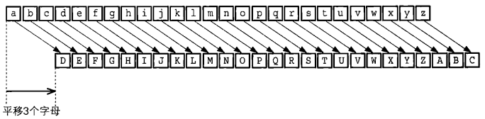
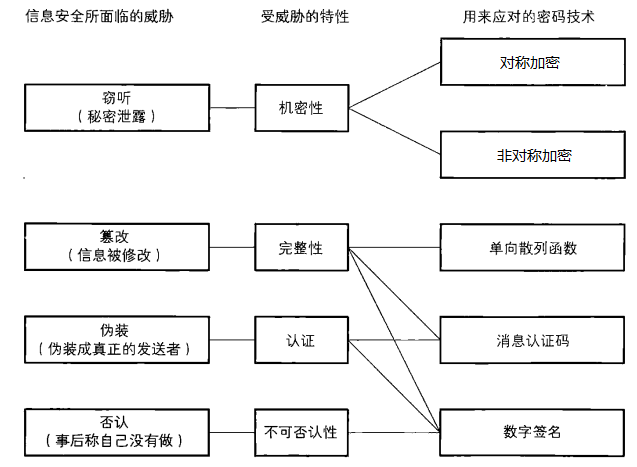

## 1.  对称加密

### 1.1 基础知识点

1. 知识点大纲介绍

   - 密码的基础概念
   - 对称加密
   - 非对称加密
   - 单向散列函数
     - 哈希函数
   - 消息认证码
   - 数字签名
   - 证书
   - ssl/tls - https

2. 为什么要加密, 以及解决方案       

   保证数据安全   

3. 加密三要素

   - 明文/密文
   - 秘钥
     - 定长的字符串
     - 需要根据加密算法确定其长度
   - 算法
     - 加密算法
     - 解密算法
     - 加密算法和解密算法有可能是互逆的, 也有可能相同

4. 常用的两种加密方式   

   - 对称加密
     - 秘钥: 加密解密使用的是同一个秘钥, 秘钥有一个
     - 特点
       - 双方向保证机密性
       - 加密效率高, 适合加密大数据, 大文件
       - 加密强度不高, 相对于非对称加密
   - 非对称加密
     - 秘钥: 加密解密使用的不同的秘钥, 秘钥有两个, 需要使用秘钥生成算法, 得到密钥对
       - 公钥 - 可以公开的秘钥
         - 公钥加密数据, 解密需要使用私钥
       - 私钥 - 需要妥善保管的秘钥, 知道的人越少越好
         - 私钥加密, 公钥解密
     - 特点:
       - 数据的机密性只能单方向保证
       - 加密效率低, 适合加密少量数据
       - 加密强度高, 相对于对称加密

5. 凯撒密码 

   恺撒密码（Caesar cipher）是一种相传尤利乌斯·恺撒曾使用过的密码。恺撒于公元前100年左右诞生于古罗马，是一位著名的军事统帅。

   > <font color="red">恺撤密码是通过将明文中所使用的字母表按照一定的字数“平移”来进行加密的</font>。

   

   - 凯撒密码加解密公式

     - 加密

     

     - 解密

       

   - 凯撒密码中的加密三要素

     - 明文/密文
       - 明文: 小写字母表中的数据
       - 密文: 大写字母表中的数据
     - 秘钥
       - 按照上图秘钥为3
     - 算法
       - 加密: +3
       - 解密: -3

   - 凯撒密码的安全性

     不安全

6. 密码信息安全常识 

   - 不要使用保密的密码算法（普通公司和个人）
   - 使用低强度的密码比不进行任何加密更危险
   - 任何密码总有一天都会被破解
   - 密码只是信息安全的一部分                   

7. 密码信息威胁 

   

   思考：信息安全处理必须要具备哪些特性？                                        

### 1.2 对称加密

> 以分组为单位进行处理的密码算法称为**分组密码（blockcipher）**

1. 编码的概念

   G = 1024m

   m = 1024kbyte

   byte  = 8bit

   bit 0/1

   > 计算机的操作对象并不是文字，而是由0和1排列而成的**比特序列**。
   >
   > 将现实世界中的东西映射为比特序列的操作称为**编码（encoding）**。
   >
   > 加密 -> 编码
   >
   > 解密 -> 解码

   hello world -> 比特序列

   h -> int 104 -> 

2. DES   --   Data Encryption Standard

   - 现在使用DES方式加密，数据还安全吗？
     - 不安全, 已经被破解了
   - 是不是分组密码？
     - 是, 先对数据进行分组, 然后在加密或解密
   - DES的分组长度?
     - 8byte == 64bit
   - DES的秘钥长度?
     - 56bit秘钥长度+8bit错误检测标志位 = 64bit == 8byte

3. 3DES   --   Triple-DES

   - 3DES安全吗?
     - 安全, 但是效率低
   - 算法描述?
     - 进行了3次des加密
   - 是不是分组密码?
     - 是
   - 3DES分组长度?
     - 8字节
   - 3DES秘钥长度?
     - 24字节, 在算法内部会被平均分成3份
   - 3DES加密过程?
     - 秘钥1 -> 加密, 秘钥2 -> 解密, 秘钥3 -> 加密
   - 3DES解密过程?
     - 秘钥1 -> 解密, 秘钥2 -> 加密, 秘钥3 -> 解密

4. AES   --   Advanced Encryption Standard

   - AES安全吗?
     - 安全, 效率高, 推荐使用的
   - 是不是分组密码?
     - 是
   - AES分组长度?
     - 128bit = 16字节
   - AES秘钥长度?
     - 128bit = 16字节
     - 192bit = 24字节
     - 256bit = 32字节
     - go中的秘钥长度只能是16字节

### 1.3 分组密码的模式

1. 按位异或

   - 第一步需要将数据转换为二进制

   - 按位异或操作符: ^

   - 两个标志位进行按位异或操作:

     - 相同为0, 不同为1

   - 举例:

     ```go
     1 0 0 0   ----> 8
     1 0 1 1   ----> 11
     -----------------------按位异或一次
     0 0 1 1   ---->  3
     1 0 1 1   ----> 11
     -----------------------按位异或两侧
     1 0 0 0   -----> 8
     =================================
     a = 8
     b = 11
     a 和 b按位异或1次 ==> 加密
     得到的结果再次和 b 按位异或 ===> 解密
     ```

2. ECB - Electronic Code Book, 电子密码本模式

   - 特点: 简单, 效率高, 密文有规律, 容易被破解
   - 最后一个明文分组必须要填充
     - des/3des -> 最后一个分组填充满8字节
     - aes -> 最后一个分组填充满16字节
   - 不需要初始化向量

3. CBC - Cipher Block Chaining, 密码块链模式

   - 特点: 密文没有规律, 经常使用的加密方式
   - 最后一个明文分组需要填充
     - des/3des -> 最后一个分组填充满8字节
     - aes -> 最后一个分组填充满16字节
   - 需要一个初始化向量 - 一个数组
     - 数组的长度: 与明文分组相等
     - 数据来源: 负责加密的人的提供的
     - 加解密使用的初始化向量值必须相同

4. CFB - Cipher FeedBack, 密文反馈模式

   - 特点: 密文没有规律,  明文分组是和一个数据流进行的按位异或操作, 最终生成了密文
   - 需要一个初始化向量 - 一个数组
     - 数组的长度: 与明文分组相等
     - 数据来源: 负责加密的人的提供的
     - 加解密使用的初始化向量值必须相同
   - 不需要填充

5. OFB - Output-Feedback, 输出反馈模式

   - 特点: 密文没有规律,  明文分组是和一个数据流进行的按位异或操作, 最终生成了密文
   - 需要一个初始化向量 - 一个数组
     - 数组的长度: 与明文分组相等
     - 数据来源: 负责加密的人的提供的
     - 加解密使用的初始化向量值必须相同
   - 不需要填充

6. CTR - CounTeR, 计数器模式

   - 特点: 密文没有规律,  明文分组是和一个数据流进行的按位异或操作, 最终生成了密文
   - 不需要初始化向量
     - go接口中的iv可以理解为随机数种子, iv的长度 == 明文分组的长度
   - 不需要填充

7. 最后一个明文分组的填充

   - 使用cbc, ecb需要填充
     - 要求: 
       - 明文分组中进行了填充, 然后加密
       - 解密密文得到明文, 需要把填充的字节删除
   - 使用 ofb, cfb, ctr不需要填充

8. 初始化向量 - IV

   - ecb, ctr模式不需要初始化向量
   - cbc, ofc, cfb需要初始化向量
     - 初始化向量的长度
       - des/3des -> 8字节
       - aes -> 16字节
     - 加解密使用的初始化向量相同

### 1.4 对称加密在go中的实现

1. des

2. 3des

3. aes

   ```shell
   # 加密流程:
   1. 创建一个底层使用des/3des/aes的密码接口
   	"crypto/des"
   	func NewCipher(key []byte) (cipher.Block, error) # -- des
   	func NewTripleDESCipher(key []byte) (cipher.Block, error)	# -- 3des
   	"crypto/aes"
   	func NewCipher(key []byte) (cipher.Block, error) # == aes
   2. 如果使用的是cbc/ecb分组模式需要对明文分组进行填充
   3. 创建一个密码分组模式的接口对象
   	- cbc
   	func NewCBCEncrypter(b Block, iv []byte) BlockMode # 加密
   	- cfb
   	func NewCFBEncrypter(block Block, iv []byte) Stream # 加密
   	- ofb
   	- ctr
   4. 加密, 得到密文
   	
   ```


## 2.非对称加密

### 1.  对称加密的弊端

- 秘钥分发困难

- 可以通过非对称加密完成秘钥的分发

  


### 2. 非对称加密的秘钥

- 不存在秘钥分发困难的问题

#### 2.1 场景分析

数据对谁更重要, 谁就拿私钥

- 直观上看: 私钥比公钥长
- 使用第三方工具生成密钥对: 公钥文件xxx.pub xxx 

> 1. 通信流程, 信息加密  （A写数据, 发送给B, 信息只允许B读）
>
> A: 公钥
>
> B: 私钥
>
> 2. 登录认证 （客户端要登录, 连接服务器, 向服务器请求个人数据）
>
> 客户端:  私钥
>
> 服务器:  公钥
>
> 3. 数字签名（表明信息没有受到伪造，确实是信息拥有者发出来的，附在信息原文的后面）
>    - 发送信息的人:   私钥
>    - 收到信息的人:   公钥
> 4. 网银U盾
>    - 个人: 私钥
>    - 银行拿公钥

### 3. 使用RSA非对称加密通信流程

> 要求: Alice 给 bob发送数据, 保证数据信息只有bob能看到

### 4. 生成RSA的秘钥对

#### 4.1 一些概念

1. x509证书规范、pem、base64
   - pem编码规范 - 数据加密
   - base64 - 对数据编码, 可逆
     - 不管原始数据是什么, 将原始数据使用64个字符来替代
       - a-z  A-Z 0-9 + /
2. ASN.1抽象语法标记
3. PKCS1标准

#### 4.2 密钥对生成流程

- 生成私钥操作流程概述

  > 1. 使用rsa中的GenerateKey方法生成私钥
  >
  > func GenerateKey(random io.Reader, bits int) (priv *PrivateKey, err error)
  >
  > - rand.Reader   -> import "crypto/rand"
  > - 1024 的整数倍 - 建议
  >
  > 2. 通过x509标准将得到的ras私钥序列化为ASN.1 的 DER编码字符串
  >
  > func MarshalPKCS1PrivateKey(key *rsa.PrivateKey) []byte
  >
  > 3. 将私钥字符串设置到pem格式块中
  >
  > 初始化一个pem.Block块
  >
  > ```go
  > type Block struct {
  >     Type    string            // 得自前言的类型（如"RSA PRIVATE KEY"）
  >     Headers map[string]string // 可选的头项
  >     Bytes   []byte            // 内容解码后的数据，一般是DER编码的ASN.1结构
  > }
  > ```
  >
  > 4. 通过pem将设置好的数据进行编码, 并写入磁盘文件中
  >
  > func Encode(out io.Writer, b *Block) error
  >
  > - out - 准备一个文件指针

- 生成公钥操作流程

  > 1. 从得到的私钥对象中将公钥信息取出
  >
  > ```go
  > type PrivateKey struct {
  >     PublicKey            // 公钥
  >     D         *big.Int   // 私有的指数
  >     Primes    []*big.Int // N的素因子，至少有两个
  >     // 包含预先计算好的值，可在某些情况下加速私钥的操作
  >     Precomputed PrecomputedValues
  > }
  > ```
  >
  > 2. 通过x509标准将得到 的rsa公钥序列化为字符串
  >
  > ```
  > func MarshalPKIXPublicKey(pub interface{}) ([]byte, error)
  > ```
  >
  > 3. 将公钥字符串设置到pem格式块中
  >
  > type Block struct {
  >     Type    string            // 得自前言的类型（如"RSA PRIVATE KEY"）
  >     Headers map[string]string // 可选的头项
  >     Bytes   []byte            // 内容解码后的数据，一般是DER编码的ASN.1结构
  > }
  >
  > 4. 通过pem将设置好的数据进行编码, 并写入磁盘文件
  >
  > func Encode(out io.Writer, b *Block) error

### 5. RSA加解密

#### 5.1 RSA加密

> 1. 将公钥文件中的公钥读出, 得到使用pem编码的字符串
>
> -- 读文件
>
> 2. 将得到的字符串解码
>
> -- pem.Decode
>
> 3. 使用x509将编码之后的公钥解析出来
>
> -- func ParsePKCS1PrivateKey(der []byte) (key *rsa.PrivateKey, err error)
>
> 4. 使用得到的公钥通过rsa进行数据加密

#### 5.2 RSA解密

> 1. 将私钥文件中的私钥读出, 得到使用pem编码的字符串
> 2. 将得到的字符串解码
> 3. 使用x509将编码之后的私钥解析出来 
> 4. 使用得到的私钥通过rsa进行数据解密

### 6. 哈希算法

### 6.1 概念

称谓: 单向散列函数, 哈希函数, 杂凑函数, 消息摘要函数

接收的输入: 原像

输出: 散列值, 哈希值, 指纹, 摘要

### 6.2 单向散列函数特性

1. 将任意长度的数据转换成固定长度的数据

2. 很强的抗碰撞性

3. 不可逆

4. MD4/MD5

   - 不安全
   - 散列值长度: 128bit == 16byte

5. sha1

   - 不安全
   - 散列值长度: 160bit == 20byte

6. sha2 - 安全

   - sha224 
     - 散列值长度: 224bit == 28byte
   - sha256
     - 散列值长度: 256== 32byte
   - sha384
     - 散列值长度: 384bit == 48byte
   - sha512
     - 散列值长度: 512bit == 64byte

   ### 6.3 go中使用单向散列函数

   ```go
   // 第一种方式, 直接调用sum
   // 适用于数据量比较小的情况
   func Sum(data []byte) [Size]byte
   
   // 第二种方式
   // 1. 创建哈希接口对象
   func New() hash.Hash
   type Hash interface {
       // 通过嵌入的匿名io.Writer接口的Write方法向hash中添加更多数据，永远不返回错误
       io.Writer
       // 返回添加b到当前的hash值后的新切片，不会改变底层的hash状态
       Sum(b []byte) []byte
       // 重设hash为无数据输入的状态
       Reset()
       // 返回Sum会返回的切片的长度
       Size() int
       // 返回hash底层的块大小；Write方法可以接受任何大小的数据，
       // 但提供的数据是块大小的倍数时效率更高
       BlockSize() int
   }
   type Writer interface {
       Write(p []byte) (n int, err error)
   }
   // 2. 往创建出的哈希对象中添加数据
   hash.Hash.Write([]byte("添加的数据..."))
   hash.Hash.Write([]byte("添加的数据..."))
   hash.Hash.Write([]byte("添加的数据..."))
   hash.Hash.Write([]byte("添加的数据..."))
   // 3. 计算结果, md5就是散列值
   md5 := hash.Sum(nil);
   // 散列值一般是一个二进制的字符串, 有些字符不可见, 需要格式化
   // 格式化为16进制的数字串 - 0-9, a-f
   func EncodeToString(src []byte) string
   // 数据转换完成之后, 长度是原来的2倍
   
   ```

   1. 计算一个大文件比如1G文件的散列值
   2. 使用udp的方式分发秘钥, 进行一个对称加密的通信
      - 服务器
        - 生成密钥对
        - 公钥发送给客户端
      - 客户端
        - 客户端收到了公钥
        - 生成一个秘钥 - 用于对称加密
        - 使用公钥加密, 发送给服务器


## 复习

1. 概念
   - 加密三要素
     - 明文/密文
     - 秘钥
     - 算法
   - 对称加密和非对称加密
     - 对称加密: 加解密使用同一个秘钥, 1个
       - 效率高
     - 非...: 密钥对
       - 公钥加密, 私钥解密
       - 私钥加密, 公钥解密
   - 对称加密中的公开的加密算法
     - des
       - 分组长度: 8字节
       - 秘钥长度: 8字节
     - 3des
       - 分组长度: 8字节
       - 秘钥长度: 24byte
     - aes
       - 分组长度: 16字节
       - 秘钥长度: 16字节, 24字节, 32字节
         - 在go的api中只能使用16字节
   - 对称加密的分组模式
     - EBC - 不推荐使用
     - CBC - 常用的方式
       - 准备的数据:
         - 初始化向量iv - 字符数组
           - 长度 == 明文分组长度
           - 加解密初始化向量值必须相同
         - 秘钥
           - 根据加密算法定