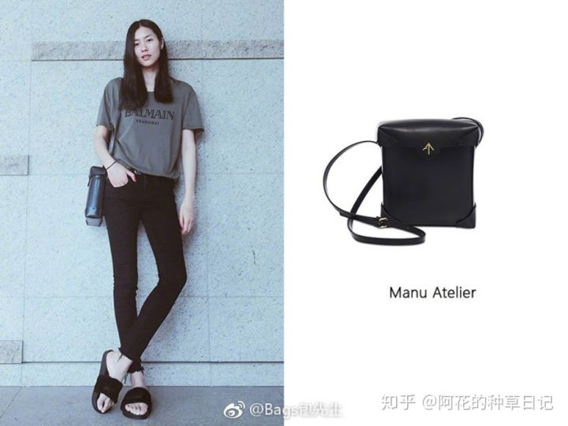

## 小众品牌(轻奢)

### staud

> 1800 - 3000 加拿大

### MANU Atelier

> 2000 - 4000 土耳其

### PINKO 品高

> 1200 - 3000 (两只燕子) 意大利

### YESE STUDIO

> 2000 - 4000 米兰设计师品牌

### by far (***)

> 2000 - 4000 法式

### mescolato 

> 1000 - 2000 韩国

### Moire

> 1000+ 韩国

### Nina Ricci

> 4000+ 法国

### 海淘攻略

+ farfetch
+ forward

## 平价

### candy rose

