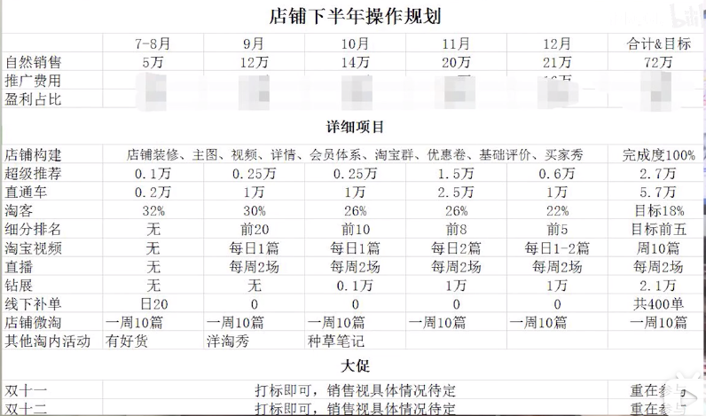

## 运营

### 选品上架

> 新店以产品为中心

新店铺50个产品左右

坚持==每天上架一个新品==(提前优化好,放仓库), 30以后 间隔一天上架新品

上架时间尽量错开, ==下架前几个小时==会提升权重

### 优化产品

==主图视频== 

==主图修改== (点击率)

> 好的主图决定产品高度,	==速滑屏幕,找到抢眼球的主图==,	记录分析他们的特点 (卖点展示方式, 构图, 色彩)
>
> 运用到自己产品上,	
>
> 直通车测图 --> 

==收藏加购==

好评率 (补单)

==到差评里面找顾客痛点==

### 上下架

> 淘宝会默认对每个宝贝 7天上下架一次(十万分之一秒), 按照类目相关性 选出十万个临近下架的宝贝 ,给这些宝贝加权排序,
>
> 找到核心竞品 找到他们的上下架时间,然后避开

### 标题

写满30字, 淘宝搜索框提示, 同行店铺标题筛选

==一级筛选词== , 生意参谋后台找到 关键词 数据 (趋势, 搜索分析, 人群分析)

### 补单

一般7天内有流量的产品可以开始补单,

找2人浏览 产品类目的商品(==通过关键词搜索==), 搜索的时候(==不要直接通过链接找==) 也顺便 点一下其他同行的商品. 

找到商品后 看看主图,详情. 第一次浏览就结束了

第二天,不用点很多其他同行的商品了, 可以==点一下排名第一==的,然后找到我们的商品 浏览2分钟,==浏览完要收藏==

第三天,可以直接从收藏里面进来浏览了,==加购物车== ,联系客服,自然==聊天==,==付款==

> 发货: 购买一个便宜东西, 上传物流单号

> 补单怎么补? 单品转化比较高有关系吗? (会不会被抓)

> 炮灰款怎么补

  炮灰款, 主推款, 副推款 都需要补单

刚上架的前2周保证在 30% 以内的转化率, 

炮灰款 每天都要补单

> 新店上新,开始怎么积累权重

店铺权重: DSR 权重, 上新率, 动销率,   ==店铺层级(拿炮灰款补单)==

单品权重: 新品权重(尽量获取新品标)

> 死店换类目怎么引流

### 推广

淘宝客

### 误区

新店铺没必要装修

不要太在乎价格(不跟别人比价格)

广告法,不能用的一些词 :

### 分析数据

看访客是根据什么 ==搜索词== 进来,  看哪些产品 ==没有浏览量== 可以(7-17天)下架.

> 行业价格带,行业交易指数,核心关键词分析,竞店锁定,竞店分析,行业全年趋势,行业指数

#### 市场分析

小草  https://www.bilibili.com/video/BV1Ut4y1Q7bh

 看==价格区间==(价格定位), 可以看每个价格区间 有==多少人喜欢==

 通过核心关键词找到行业前10的店铺, ==动态评分==(反映顾客满意度)

 ==关键词分析== (生意参谋关键词数据) 找到风格

==> 通过 价格,风格 找到竞品

 分析爆款图案共性和审美

#### 新产品规划 

### 每日工作

> 职业规划: 利润, 能力 , 积累资源人脉

1. 竞品观察

   观察20个竞品(主图, 营销 , sku ,流量渠道 , 核心卖点, 核心关键词 等制作表格), 每周一周五 追踪变化, 看什么原因导致变化 (学习整改产品的经验)

2. 流量渠道扩充

   观察竞品:例如什么时候开始直播

3. xx

## 设计

### 主图

规范: (天猫)

1. 尺寸:大于等于800px*800px
2. Logo放在左上角,比例要求宽度为图片大小2/5以内,高度1/5以内
3. 不允许拼接 (不得出现多个主体)
4. 第一张主图必须为实物图, 不得出现边框 水印, 促销文字

## 关键词

### 康康包

康康 35	单肩 33	空姐	31	斜挎 27	豆腐 24	真皮 24	新款 22	

小方包 21  	h扣 20 	牛皮 12 	掌纹 12	2021 10	手工 9	

> [MENGDI 女包]2021新款h扣单肩斜挎真皮掌纹空姐康康包豆腐小方包

### channel

斜挎 33	链条33	菱格32	单肩29	小香风28	真皮25	口盖19	2021 18	

云朵9	欧阳娜娜8

>  [MENGDI 女包]2021新款轻奢单肩小香风头层皮斜挎口盖链条菱格包

### 白方包

单肩39	新款33	链条31	斜挎29	山茶花18	真皮15	小方包11	铆钉10	翻盖7	质感6

> [MENGDI 女包]2021新款轻奢单肩小香风头层皮斜挎口盖链条菱格包

 