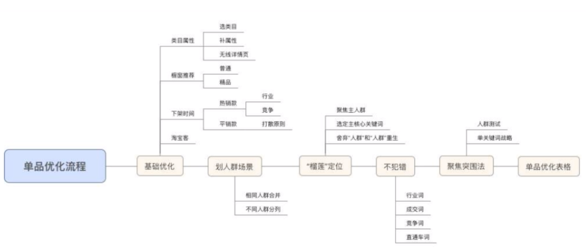
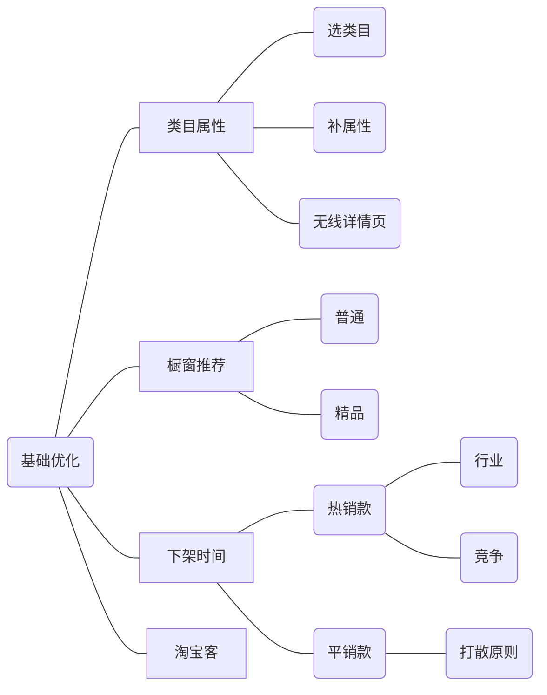

## 基础优化

```mermaid
graph LR

	base(基础优化) --- leimu[类目属性] ;
	leimu --- l1(选类目)
	leimu --- l2(补属性)
	leimu --- l3(无线详情页)
	
	base(基础优化) --- chuchuang[橱窗推荐] ;
	chuchuang --- c1(普通)
	chuchuang --- c2(精品)
	
	base(基础优化) --- xiajia[下架时间] ;
	xiajia --- x1(热销款)
	x1 --- x11(行业)
	x1 --- x12(竞争)
	xiajia --- x2(平销款)
	x2 --- x21(打散原则)
	
	base(基础优化) --- taobao[淘宝客] ;
```

### 类目属性

搜索核心原理:

> 搜索 : 苹果手机 , 不会出现苹果手机壳,或者苹果手机电池
>
> 后台 先根据 手机 (类目) 来筛选关键词 "苹果" ,屏蔽掉了 手机壳, 电池
>
> 所以搜索的第一步,是根据关键词来 选择类目

